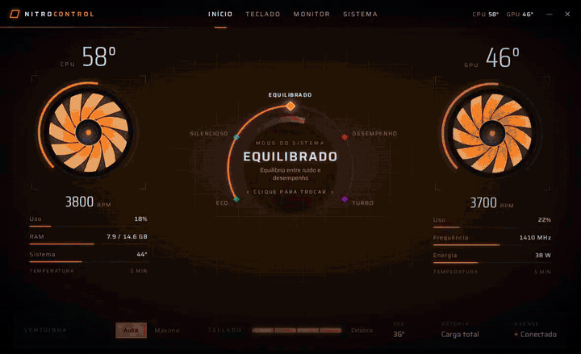
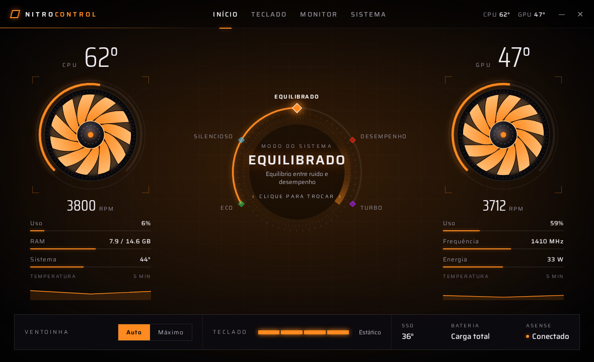
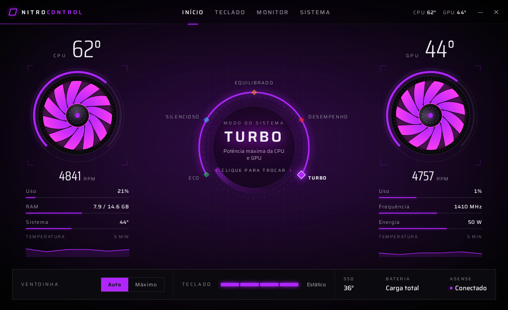
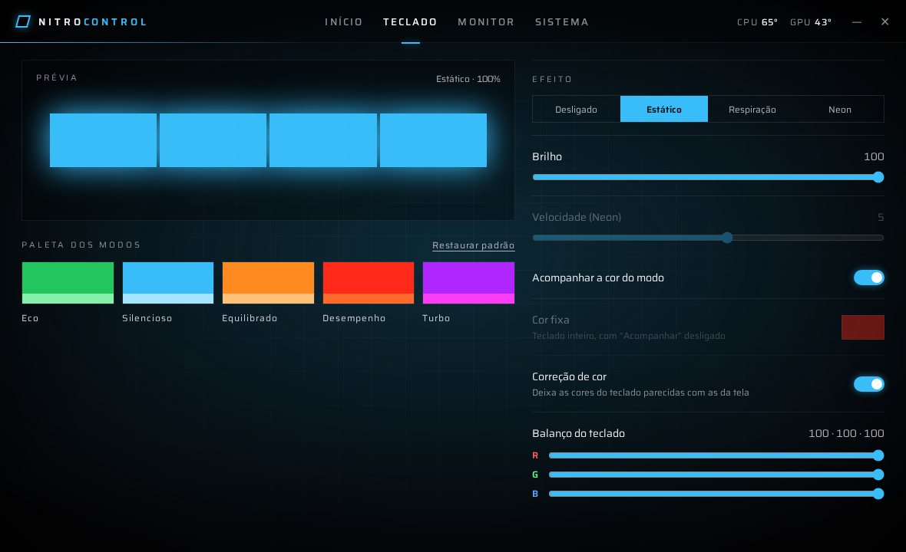
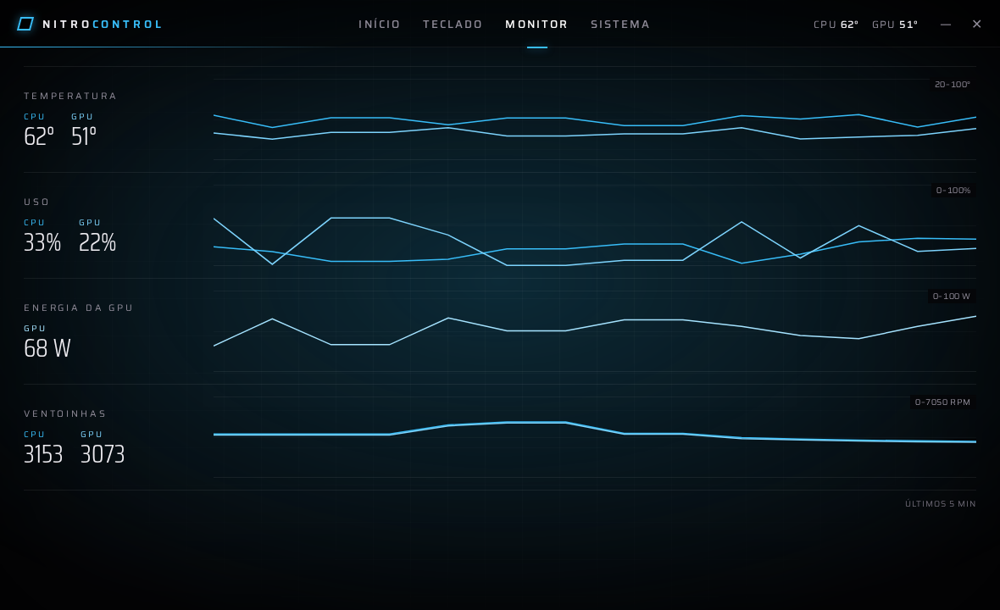
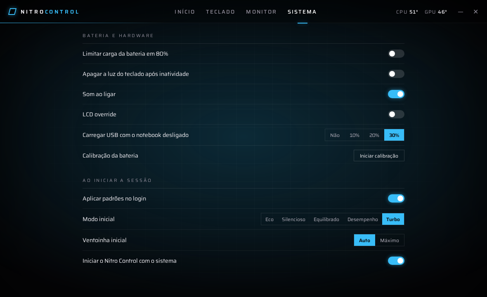

<div align="center">

# ⬡ Nitro Control

**Painel de controle estilo NitroSense para o Acer Nitro AN16-51 no Linux**

Modos de desempenho com cor e animação, RPM real das ventoinhas, temperaturas,
RGB do teclado acompanhando o modo e ícone na barra do GNOME. Tudo por cima do
[ASense](https://github.com/fladirm/asense), sem mexer no EC.




<sub>Gravado no modo demonstração (<code>?demo=1</code>), com dados simulados.</sub>

</div>

---

## ✨ O que ele faz

| | |
|---|---|
| 🎛️ **5 modos com identidade própria** | Eco, Silencioso, Equilibrado, Desempenho e Turbo. Cada modo tem sua cor: a janela inteira e o teclado mudam junto, com uma animação cinematográfica na troca. |
| 🌀 **RPM real das ventoinhas** | Hélices animadas quadro a quadro na velocidade de verdade (hwmon `acer`, `predator_v4`), com arco de rotação. |
| 🌡️ **Temperaturas sempre à vista** | CPU e GPU no ícone da barra do GNOME e no cabeçalho do app; uso, RAM, frequência, energia da GPU e SSD na tela inicial. |
| ⌨️ **Teclado que acompanha o modo** | Cor estática fixa na cor do modo, com correção de gamma e balanço R/G/B para o LED bater com a tela. Também tem Respiração, Neon e Desligado. |
| 🔄 **Sincronizado com o hardware** | Se o modo mudar por fora (tecla de modo, GNOME, script), a interface percebe em até 1 s e anima a troca. A tela só mostra o que o hardware confirmou. |
| 📈 **Monitor de 5 minutos** | Gráficos de temperatura, uso, energia da GPU e ventoinhas. |
| 🔋 **Opções da plataforma** | Limite de carga em 80%, calibração da bateria, carga USB desligado, som de boot e timeout da luz do teclado. |
| 🚀 **Padrões do login** | Modo e ventoinha iniciais aplicados no autostart. A tecla NitroSense abre e fecha o painel. |
| 🪶 **Leve em segundo plano** | Com a janela fechada, não consulta a GPU dedicada e deixa ela dormir. |

## 🖼️ Telas

<table>
  <tr>
    <td></td>
    <td></td>
  </tr>
  <tr>
    <td align="center"><b>Início</b>: dial de modos, ventoinhas e faixa de controles</td>
    <td align="center"><b>Turbo</b>: cada modo pinta a interface inteira</td>
  </tr>
  <tr>
    <td></td>
    <td></td>
  </tr>
  <tr>
    <td align="center"><b>Teclado</b>: efeito, brilho, paleta e correção de cor</td>
    <td align="center"><b>Monitor</b>: últimos 5 minutos</td>
  </tr>
  <tr>
    <td colspan="2"></td>
  </tr>
  <tr>
    <td colspan="2" align="center"><b>Sistema</b>: bateria, hardware e padrões do login</td>
  </tr>
</table>

### Paleta dos modos

| Modo | Cor | Descrição |
|---|---|---|
| Eco |  | Menor consumo, ideal na bateria |
| Silencioso |  | Ventoinhas baixas, uso leve |
| Equilibrado |  | Equilíbrio entre ruído e desempenho |
| Desempenho |  | Mais potência para jogos |
| Turbo |  | Potência máxima da CPU e GPU |

A paleta é editável na aba Teclado e vale para a janela e para o teclado.

## 🧩 Como funciona

```
                ┌──────────────────────── nitro-control (Tauri 2) ────────────────────────┐
                │                                                                          │
 ícone GNOME ◀──┤  tray ◀──┐                                      ┌──▶ janela (HTML/CSS/JS)│
                │          │   eventos: snapshot · mode-changed   │     Início · Teclado   │
                │        ┌─┴──────────────────────────────────────┴┐    Monitor · Sistema  │
                │        │  hub (thread, tick de 1 s, sem Tauri)   │◀── comandos Tauri     │
                │        └──┬──────────────┬───────────────┬───────┘                       │
                └───────────┼──────────────┼───────────────┼───────────────────────────────┘
                            │              │               │
             /run/asense-control.sock   /sys  /proc    asense_rgb/effect
              (asensed: modos, fan,    hwmon acer,     (estático do teclado,
               iluminação, bateria)    coretemp, nvme,  via regra udev)
                                       platform_profile,
                                       nvidia-smi*
```

<sub>* só com a janela aberta, no máximo a cada 5 s, e nunca com a GPU em repouso.</sub>

- **`hub`**: guarda a única conexão com o daemon do ASense, que só aceita uma sessão por vez. Lê os sensores, calcula o que mudou e emite eventos. Aplica os padrões do login e recolore o teclado quando o modo muda. É testado sem Tauri, com um daemon falso.
- **Interface**: HTML, CSS e ES modules puros, sem bundler. Só reflete estado confirmado.
- **Teclado estático**: neste modelo o `STATIC` do daemon falha e o firmware só aceita uma cor global. O app pinta com `BREATHING` na velocidade 0 e fixa o efeito estático direto no driver.

## 📋 Requisitos

- **Acer Nitro AN16-51.** Outros Nitro/Predator com `acer_wmi` podem funcionar em parte, mas não foram testados.
- **Ubuntu 26.04 / GNOME**, com a extensão AppIndicator (vem no Ubuntu).
- **[ASense](https://github.com/fladirm/asense) 0.3.0** instalado, com o `asense_rgb` via DKMS e o socket `asense.socket` ativo.
- **`acer_wmi` com `predator_v4=1`**, para o RPM real e a leitura do modo:
  ```bash
  echo "options acer_wmi predator_v4=1" | sudo tee /etc/modprobe.d/acer-wmi-predator.conf
  ```
- **Nenhum driver concorrente** na mesma interface WMI (por exemplo `facer` / Linuwu-Sense).
- **GPU NVIDIA** com `nvidia-smi`, opcional, para uso, frequência e energia da GPU.

## 📦 Instalação

```bash
# dependências de build (uma vez)
sudo apt install libwebkit2gtk-4.1-dev libayatana-appindicator3-dev librsvg2-dev build-essential libssl-dev
cargo install tauri-cli --version "^2" --locked

# gerar e instalar o pacote
cd src-tauri
cargo tauri build
sudo apt install ./target/release/bundle/deb/"Nitro Control_0.1.0_amd64.deb"
```

O pacote instala `/usr/bin/nitro-control`, o atalho no menu e a regra udev
`99-nitro-control.rules`, que libera ao grupo `plugdev` só o efeito do teclado.

### Migrar da interface do ASense

```bash
bash packaging/migrar.sh          # autostart, tecla NitroSense → nitro-control --toggle, com backup
bash packaging/reverter.sh <backup>   # desfaz
```

### Uso

| Ação | Como |
|---|---|
| Abrir / fechar o painel | tecla NitroSense (`XF86Launch1`) ou `nitro-control --toggle` |
| Trocar o modo | clique no centro do dial (próximo) · botão direito (anterior) · roda do mouse · losangos e nomes · menu do ícone |
| Iniciar escondido | `nitro-control --hidden` (usado pelo autostart) |
| Fechar de vez | ícone na barra → **Sair** (o ✕ só esconde a janela) |

A configuração fica em `~/.config/nitro-control/config.toml`.

## 🛠️ Desenvolvimento

```bash
cd src-tauri && cargo test --lib        # 69 testes: cliente, sensores, hub, config, automação
node --test tests-ui/*.test.mjs         # 11 testes da lógica da interface
cd ui && python3 -m http.server 8765    # abrir http://localhost:8765/?demo=1 (modo demonstração)
```

```
src-tauri/src/
  asense/     cliente do socket + parse do protocolo (OK/ERR, DIAG, CAPS, PLATFORM)
  sensors.rs  hwmon por nome, /proc, GPU sem acordá-la, platform_profile
  hub.rs      loop central: conexão, sensores, diffs, eventos, automação
  automation.rs  plano de iluminação (gamma, balanço, estático) e padrões do login
  config.rs · state.rs · tray.rs · commands.rs · lib.rs
ui/
  index.html · css/ · fonts/ (Saira, OFL) · js/app.js · js/tabs/*.js
docs/superpowers/   especificação e plano de implementação
fixtures/           respostas reais do daemon usadas nos testes
```

## ⚠️ Limitações conhecidas

- **Uma cor só para o teclado:** o firmware do AN16-51 não aceita cores diferentes por zona.
- **Velocidade só no Neon:** Estático e Respiração exigem velocidade 0.
- **LED do botão de modo:** é controlado pelo firmware, e o Linux não recebe comando de cor para ele.
- **Sem a regra udev**, o "Estático" fica em Respiração, na cor certa.
- O modo de energia do GNOME só controla o perfil depois de um reboot com `predator_v4` ligado.

## 🗺️ Próximos passos

Ajustes menores registrados na revisão final: defaults por campo na config,
aviso quando falta a regra udev, reconectar e tentar de novo em caso de queda
do daemon, releitura periódica da bateria, feedback do menu da barra com a
janela escondida e polimento do empacotamento.

## 🙏 Créditos

- [ASense](https://github.com/fladirm/asense), de Fladirmacht: o daemon e o driver que fazem o trabalho pesado.
- Fontes [Saira e Saira Condensed](https://fonts.google.com/specimen/Saira) (SIL Open Font License 1.1).
- Visual inspirado no NitroSense, recriado do zero em CSS/SVG, sem nenhum asset da Acer.

<sub>Projeto pessoal, sem afiliação com a Acer. “Nitro” e “NitroSense” são marcas da Acer Inc.</sub>
